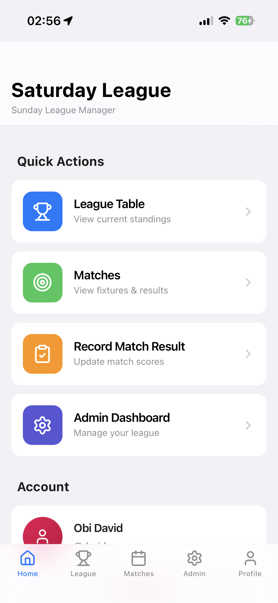
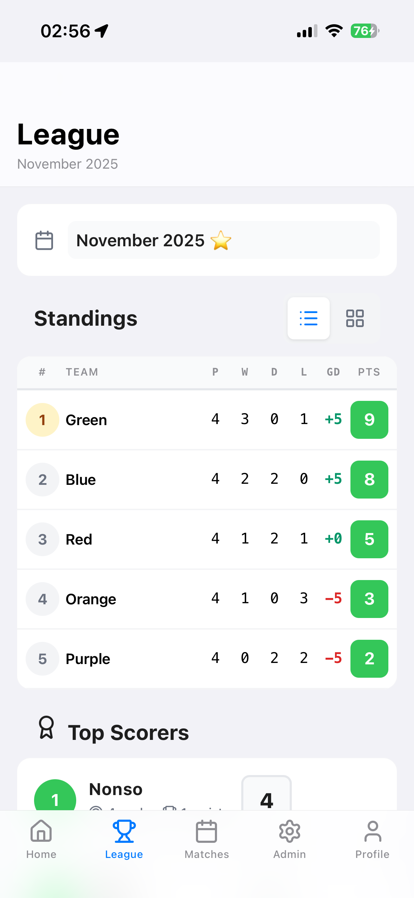
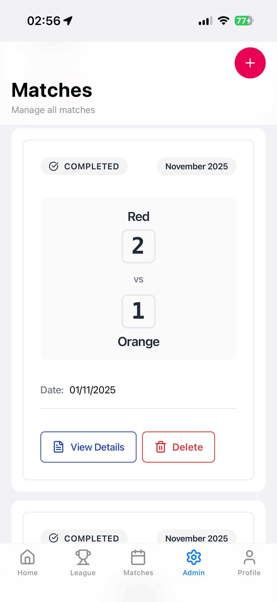
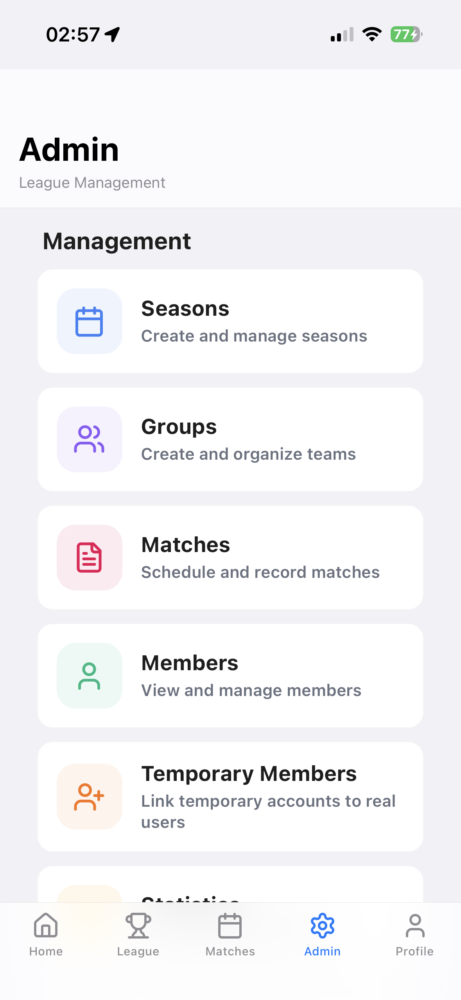
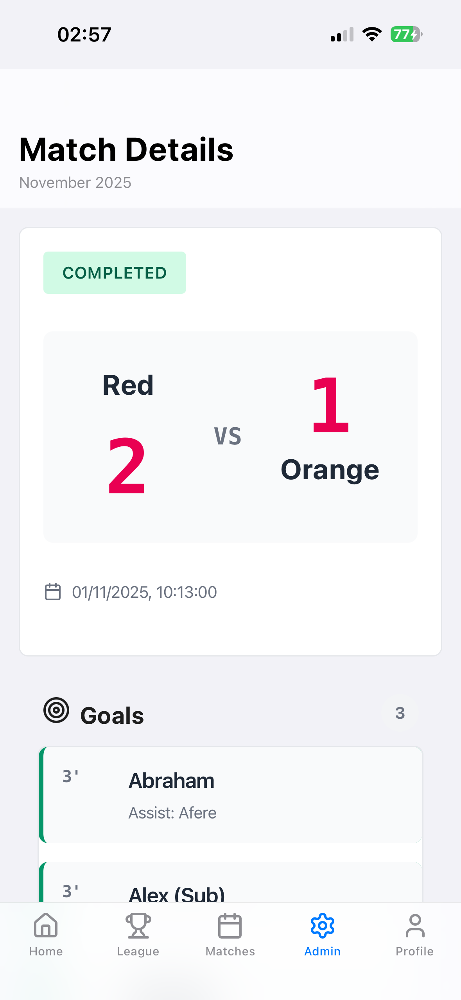

# ⚽ Sunday League Manager

A Progressive Web App (PWA) for managing Sunday league football matches, scores, player statistics, and league tables for Sunday League.

## Screenshots

| | |
|:------------------------------------------------------------------------------------------:|:------------------------------------------------------------------------------------------:|
|  |  |
|  |  |
|  |

## Features

- 📱 **Mobile-First PWA** - Installable on mobile devices with offline support
- 👥 **Member Registration** - Players can register and create accounts
- 🔐 **Authentication** - Secure login system with role-based access (Admin/Member)
- ⚽ **Match Management** - Record matches with detailed information
- 🎯 **Goals & Assists** - Track who scored and assisted each goal
- 🟨🟥 **Cards Tracking** - Record yellow and red cards with reasons
- 📊 **League Table** - Automatic calculation of league standings
- 🏆 **Player Statistics** - Top scorers, assists, and disciplinary records
- 👥 **Group Management** - Create and manage different teams/groups
- 📅 **Season Management** - Organize matches by seasons
- 👤 **Temporary Players** - Add and manage temporary players for one-off games
- 🗓️ **Fixture Generation** - Automatically generate fixtures for a season
- 🧑‍⚖️ **Referee Role** - Assign referees to matches
- 🟨 **User Suspension** - Suspend users for a specified period
- ⚙️ **Customizable Settings** - Change the league name and other settings

## Tech Stack

- **Frontend**: Next.js 15, React, TypeScript
- **Styling**: CSS Modules (separate CSS files)
- **Backend**: Next.js API Routes
- **Database**: SQLite with Prisma ORM
- **Authentication**: NextAuth.js
- **PWA**: next-pwa
- **Containerization**: Docker & Docker Compose

## Database Schema

The app uses a relational database schema to manage all aspects of the league. The main models are:

- **User**: Stores player profiles, roles (Admin, Member, Referee), and authentication details. It also tracks user-specific data like suspensions.
- **Season**: Represents a playing period (e.g., "2025 Season") and groups together related teams and matches.
- **Group**: Represents a team within a season.
- **GroupMember**: A through table linking Users to Groups, representing team rosters.
- **Match**: Holds details for individual matches, including teams, scores, date, location, and status.
- **MatchPlayer**: A through table tracking which players participated in a specific match.
- **Goal**: Records each goal scored in a match, including the scorer and (optionally) the player who assisted.
- **Card**: Tracks yellow and red cards issued to players during a match.
- **Settings**: A singleton table for global application settings like the league name.

Relationships are defined to link these models, for example, a `Match` is linked to two `Groups` (home and away), a `Season`, and multiple `Goals` and `Cards`.

## Getting Started

### Prerequisites

- Node.js 20+
- npm or yarn
- Docker (optional, for containerized deployment)

### Local Development

1. **Clone and navigate to the project**:
   ```bash
   cd sunday-league
   ```

2. **Install dependencies**:
   ```bash
   npm install
   ```

3. **Set up environment variables**:
   ```bash
   cp .env.example .env
   ```

   Update `.env` with your values:
   ```env
   DATABASE_URL="file:./dev.db"
   NEXTAUTH_URL="http://localhost:3000"
   NEXTAUTH_SECRET="your-secret-key"
   ```

   Generate a secret key:
   ```bash
   openssl rand -base64 32
   ```

4. **Run database migrations**:
   ```bash
   npx prisma migrate dev
   ```

5. **Seed the database (optional)**:
   You can create an admin user directly in the database or via the registration API.

6. **Run the development server**:
   ```bash
   npm run dev
   ```

7. **Open [http://localhost:3000](http://localhost:3000)** in your browser

### Docker Deployment

As per your preference, the project includes Docker configuration:

1. **Build and run with Docker Compose**:
   ```bash
   docker-compose up --build
   ```

2. **Access the app at [http://localhost:3000](http://localhost:3000)**

3. **Stop the containers**:
   ```bash
   docker-compose down
   ```

## API Routes

### Authentication
- `POST /api/auth/register` - Register new user
- `POST /api/auth/[...nextauth]` - NextAuth.js endpoints

### Seasons
- `GET /api/seasons` - List all seasons
- `POST /api/seasons` - Create season (admin only)

### Groups
- `GET /api/groups?seasonId={id}` - List groups
- `POST /api/groups` - Create group (admin only)

### Matches
- `GET /api/matches?seasonId={id}&status={status}` - List matches
- `POST /api/matches` - Create match (admin only)
- `GET /api/matches/[id]` - Get match details
- `PATCH /api/matches/[id]` - Update match (admin only)
- `DELETE /api/matches/[id]` - Delete match (admin only)

### Goals & Cards
- `POST /api/matches/[id]/goals` - Add goal (admin only)
- `POST /api/matches/[id]/cards` - Add card (admin only)

### League
- `GET /api/league/[seasonId]` - Get league table and top scorers

## Project Structure

```
sunday-league/
├── app/
│   ├── api/              # API routes
│   ├── auth/             # Auth pages
│   ├── league/           # League table pages
│   ├── admin/            # Admin dashboard
│   ├── layout.tsx        # Root layout
│   ├── page.tsx          # Home page
│   └── globals.css       # Global styles
├── lib/
│   ├── prisma.ts         # Prisma client
│   ├── auth.ts           # Auth configuration
│   └── league-utils.ts   # League calculations
├── prisma/
│   ├── schema.prisma     # Database schema
│   └── migrations/       # Database migrations
├── public/
│   ├── manifest.json     # PWA manifest
│   └── icons/            # App icons
├── types/                # TypeScript type definitions
├── docker-compose.yml    # Docker Compose config
├── Dockerfile            # Docker configuration
└── README.md             # This file
```

## User Roles

### Member
- View league tables and statistics
- View match details
- View their own profile and stats

### Admin
- All member permissions
- Create and manage seasons
- Create and manage groups
- Create and edit matches
- Record goals, assists, and cards
- Manage user accounts

## Creating Your First Admin User

1. Register a new user via the UI or API
2. Manually update the user's role in the database:
   ```bash
   npx prisma studio
   ```
   Navigate to the `User` model and change the role to `ADMIN`

## Development Scripts

```bash
# Development
npm run dev          # Start dev server
npm run build        # Build for production
npm run start        # Start production server

# Database
npx prisma studio    # Open Prisma Studio
npx prisma migrate dev  # Run migrations
npx prisma generate  # Generate Prisma Client

# Docker
docker-compose up --build  # Build and run
docker-compose down        # Stop containers
```

## PWA Features

The app is installable as a PWA on mobile devices:

- **Offline Support**: Basic offline functionality
- **Add to Home Screen**: Install on mobile devices
- **App-like Experience**: Runs in standalone mode
- **Responsive Design**: Mobile-first UI

## Future Enhancements

- [ ] Real-time match updates
- [ ] Push notifications for match days
- [ ] Player injury tracking
- [ ] Advanced statistics and analytics
- [ ] Export data to CSV/PDF
- [ ] Multi-language support
- [ ] Dark mode

